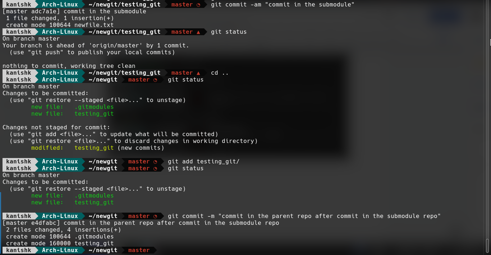

Git & GitHub tutorial

Content of the following tutorial is taken from the books [Pro Git by Chacon & Straub](https://drive.google.com/file/d/1K5cXYwrOfj2A7_D5HEXak9VkhWxZS7o9/view?usp=sharing) and [Git Community Book](https://github.s3.amazonaws.com/media/book.pdf).

#### **Download Git**

If installed, the command git --version will print out the installed git version.

Download Git for Windows here: [https://git-scm.com/download/win](https://git-scm.com/download/win). MacOS has Git preinstalled. If not, [follow this page](https://git-scm.com/download/mac).

#### **First time Git setup**

1. git config --global user.name "Your Name"

2. git config --global user.email "[yourname.1234@yahoo.com](mailto:yourname.1234@yahoo.com)"

3. (optional) git config --global init.defaultBranch main

#### **Tip**

##### If you want to override the default global values for a specific project (for example, to use a work email address), you can run the git config command without the --global option while in that project (For example git config user.email "[yourname@pilani.bits-pilani.ac.in](mailto:yourname@pilani.bits-pilani.ac.in)").

#### **Let’s get started!**

Go into a folder (a new/existing), right click and select Open with Git Bash. Alternatively, open command prompt/powershell/terminal and navigate to your desired folder.

1. Initialize the folder as a git repository using

git init

2. Check the status of the folder using

git status

3. Do something inside this git folder (except deleting the folder itself lol). You can make new files, copy some of your existing files to this folder, or edit any existing files. You can even make a new folder and put files inside that new folder.

4. Check status again

5. Stage the changes using

git add .

#### **Tip**

The ‘dot’ in the end signifies "‘all contents at the current folder”. If you want to stage only a specific file/folder, use 

git add myPythonFile.py myNewFile.cpp myBITSFile.txt myFolder

where you specify the file/folder names you want to add. 

6. Check the status using

git status

7. Commit your staged changes using

git commit

	Write your commit message and exit out of the commit screen. Don’t close the window, just close the editor opened by the command git commit.

**That’s it!** 

You have made your very first commit. If you change something inside this folder, you can always revert to the first commit you made, which is the state of your folder currently (right after the commit). 

To see this in action change the folder contents like adding/editing a file/folder, stage the changes using git add . and committing the changes using git commit.

Check the commit hash of your first commit using the command git log (it will be something like

Copy the commit hash number (the one having time and date of your first commit) and do 

git checkout a209394d41d2529da33803840d16f69ecca69577

Now your folder is back to the state it was at that date and time. You can switch between commits just like that :)

Below is a demo of everything done till now:

#### **Branching and merging**

Magic lies in git branching. Wanna see? Follow along with the demo.

#### **Finally moving online on GitHub**

Make a new [GitHub account](github.com) and a new repository in your account. Make sure to have basic knowledge about **[intellectual property** ](https://choosealicense.com/)[licenses](https://choosealicense.com/) and add a relevant license to every repo you make. Read more about the [legal side of Open Source software here](https://opensource.guide/legal/).

#### **Tip**

With BITS Pilani email students can avail the [GitHub PRO service](https://github.com/settings/billing/plans) **Absolutely FREE**. It is very useful if you want to make a private team. Below is a small snap of a very large list of available services with a PRO account.

#### **Working on GitHub repo**

Download the GitHub repository either using the command in Step 1 below, or directly extracting the ZIP format of the repo.

1. If you downloaded the ZIP format, unzip the folder and skip this step. Otherwise open the Git Bash/terminal/powershell and type

git clone https://github.com/yourUserName/yourRepoName.git

2. A new folder is made which is your GitHub repository. You can go inside this repository and see everything that is up there online on GitHub.

3. Make some changes in this repository, like adding/editing file(s)/folder(s), or making new branches. The repository (set of files and folders on your computer) is called local, because it exists as a copy of the files on GitHub. Any changes made here are not directly reflected in the repository on Github. To reflect these changes in the repository on Github (which is called a remote repository), you need to push the changes.

4. Push these changes online so that they reflect on GitHub

    1. git push origin branchName    

**origin** is the alias of your remote GitHub repository.

**branchName** can be ‘master’ or any new branch that you made. You will have to repeat this command for every branch in which you made changes.

Ideally, we commit changes more frequently in a local repository, but don’t push every commit every single time. You tend to push commits so that changes are reflected online. This means that if you’re collaborating with someone else, they can receive your changes, which in fact is **one of the most powerful features of git and GitHub.** Before you push, you typically fetch changes, but you can skip this step since you’re working alone.

#### **Tip**

You can have many upstream repositories with different aliases. Default alias for a single local-remote repo pair is **origin**. You can add another remote repository using

git remote add **remoteName** https://github.com/userName/repoName.git

Now you can push and pull from both remote repositories.

#### **Merge conflicts**

Merge conflicts happen whenever two branches have ‘line-level’ content conflict. It means if a file has been changed at the same line in two branches after a common commit, then there will be a merge conflict if one tries to merge the two branches. Git cannot decide which branch has correct code, so it leaves marks inside the conflicting regions for the programmer to solve.

To see a merge conflict yourself, make a new branch and commit something in an existing file. Now go back to the master branch, edit the same line in that file and commit it. At this point the master branch commit and the other branch commit are a divergence of the same previous commit, basically two different histories of the same file. Now merging the other branch into master will result in a merge conflict.

1. Make a new file with the name newfile.txt.

2. Make a new commit using git commit.

3. Checkout into a new branch using 

Merge conflict marks in a file look like this:

1. Line 1 says the **current location** which is HEAD (when you try to merge another branch into the current branch, which is also the location of the HEAD pointer)

2. Line 2 lists the contents present inside **HEAD**.

3. Line 5 says the location that you’re trying to merge (here I am trying to merge newbranch into the master branch using git merge newbranch while being present in the master branch)

4. Line 4 lists the contents present in the **newbranch**

5. Line 3 is a separator between the two conflicts.

Programmers have to manually solve this conflict by editing the messy file itself.

After removing the merge conflict disarrangement, my file looks like this:

Now staging the clean file using git add myFile.txt and committing it using git commit --message "Merge conflicts resolved", the merge conflict has been resolved.

#### **Submodules**

Oftentimes one needs to use someone else’s work from within their own repository. A common issue arises in these scenarios: you want to be able to treat the two projects as separate yet still be able to use one from within the other.

The way you add another repository into your repository is by doing

	git submodule add [https://github.com/userName/repoName.git](https://github.com/userName/repoName.git)

Anything you do outside of the submodule folder doesn’t affect the submodule folder, but every time you do anything in your submodule, you need to 

1. Commit the submodule repository, 

2. Go out of the submodule repository while being inside the parent repository, and 

3. Commit in the parent repository.

See carefully the following demo

Whenever a repository having a submodule is pushed on GitHub, it shows the submodule not as a regular folder but as a link to the submodule repository.

Sometimes one needs to delete the submodule. Deleting a submodule involves 3 steps

1. Deleting the submodule folder itself

2. Deleting the folder .git/modules/submoduleName (mind the ‘dot’)

3. Editing the .gitmodules file and removing the lines for the submodule

Now staging and committing the repository again will have the submodule removed completely. If you push the repo, the link to the submodule is gone.

#### Task

This is just to see if you have understood using git from git bash (terminal), in conjunction with GitHub. Create a repository, and try out as many of these commands as you can - create multiple branches, commits; try to merge them. As a bonus, try to find online, how you can undo a commit (for those oopsies and spelling mistakes ;), go back to a different commit to view older files, perhaps even create a branch from an old point in history. You must be able to use the commands add, commit, push, pull and branch as these are used very frequently. However, use this opportunity to try out the rest as well, because they can get challenging when you actually have to use them. To view how much you’ve understood, we’d like you to share the history of your repo. For this type the command:

git log--graph--pretty="%C(bold blue)%h" --decorate --all

git log --graph --pretty="%C(yellow) Hash: %h %C(blue)Date: %ad %C(red) Message: %s " --date=human

git log --all --decorate --oneline --graph

You can submit the outputs of these commands to us, preferably as text (.txt), but you can also send screenshots if there are formatting problems.

